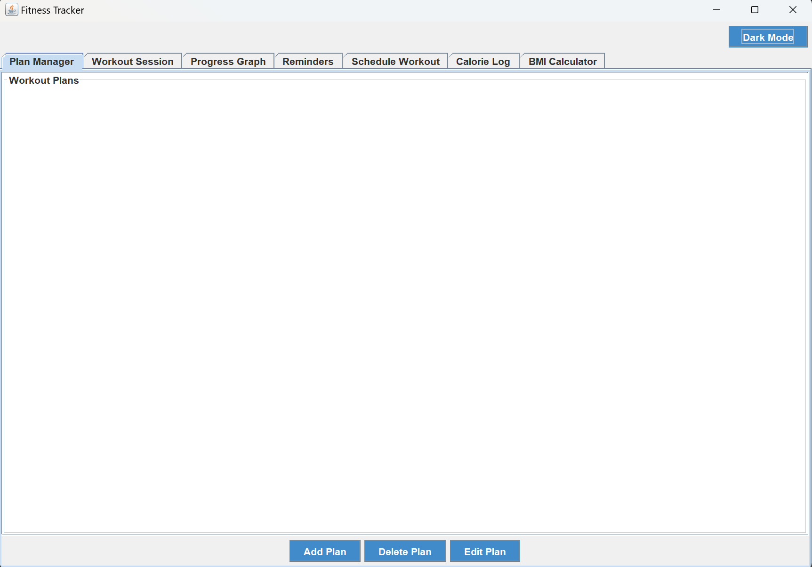
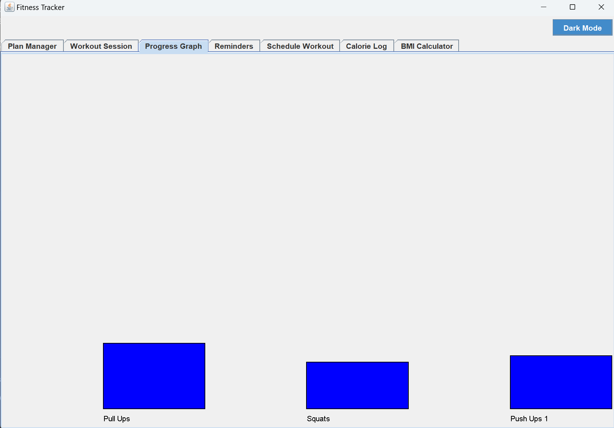

# 🏋️‍♂️ Fitness Tracker App (Java + Swing GUI)

A desktop-based Fitness Tracker application developed in Java using **Swing GUI framework** and structured around the **Model-View-Controller (MVC)** design pattern. This application serves as a complete fitness companion allowing users to track workouts, log meals, calculate BMI, manage reminders, and visualize progress — all within a responsive user interface.

---

## 📌 Project Overview

This Java application was built as a **semester project** for the Object-Oriented Analysis & Design (OOAD) course. It emphasizes clean code structure, modularity, and reusable components using **OOAD principles** like Encapsulation, Composition, Low Coupling, and High Cohesion.

---

## 🎯 Features

| Module                  | Functionality                                 |
|-------------------------|-----------------------------------------------|
| 💪 Workout Plan Manager | Create, edit, and delete workout routines     |
| 🧠 Workout Session      | Track real-time sets and reps per exercise    |
| 📊 Progress Graph       | Visualize workout progress with bar charts    |
| 🍽️ Calorie Logger       | Log meals and auto-calculate total calories   |
| ⚖️ BMI Calculator       | Metric and Imperial support for BMI           |
| 🕒 Reminders & Schedules| Add workout reminders and daily routines      |
| 🎨 Theme Manager        | Light and Dark theme support                  |

---

## 🧠 Concepts Applied

- MVC Architecture (Model-View-Controller)
- OOAD Principles (SRP, Encapsulation, Composition, GRASP)
- Java Swing for GUI (JPanel, JTabbedPane, Listeners)
- Java Date & Time API (LocalDateTime, Duration)
- System Tray Notifications
- Timer and Threading for sessions/reminders

---

## 🗂️ Folder Structure

```bash
FitNess/
├── fitnesstracker/
│   ├── model/         # Business logic: Workout, BMI, Meal, Reminder
│   ├── controller/    # Controllers to modify model data
│   ├── view/          # Swing GUI panels
│   └── Main.java      # Entry point
├── screenshots/       # App UI screenshots (for GitHub display)
├── out/               # Compiled .class files (auto-generated)
└── README.md
```


---

## ⚙️ Requirements

- Java JDK 11 or above
- Works on Windows, Linux, or macOS
- Terminal / Command Prompt / PowerShell

---

## 🚀 How to Compile & Run

### 1. Open a terminal and go to your project root:

```bash
cd path/to/FitNess
```
### Compile all .java files:
On Windows (CMD or PowerShell):
```bash
javac -d out fitnesstracker\**\*.java
```
On Linux/macOS:
```bash
javac -d out fitnesstracker/**/*.java
```

 Run the application:
 ```bash
java -cp out fitnesstracker.Main
```


## 🖼️ Screenshots

### 🏠 Landing Page


### 📊 Progress Graph (Bar Chart)


### 🏋️ Workout Session Panel


License
This project is licensed under the MIT License.


Authors
Daiwik,Bhaveen
B.Tech Computer Science – Semester 6
PES University
Course: UE22CS372 – OOAD (Object Oriented Analysis and Design)
